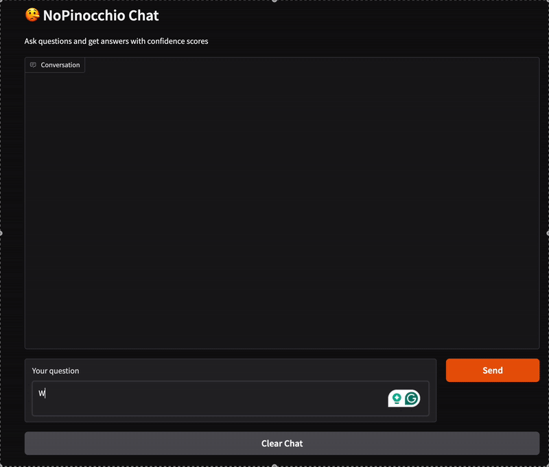

# NoPinocchio

A tool that adds confidence scores to your LLM's output.

## Motivation

LLMs boost productivity in areas like coding and writing. However, their usefulness is often limited by incorrect outputs and hallucinations. As a result, users spend a lot of time verifying AI-generated content. Confidence estimates can help users quickly judge which outputs are likely reliable and which ones need a closer look.

I propose **NoPinocchio**, a tool that adds confidence scores to your LLM's responses to improve trust, usability, and efficiency.

The idea for this tool is inspired by [Cleanlab’s Trustworthy Language Model](https://cleanlab.ai/tlm/). However, since their code is not open source, I implemented the algorithm based on their [research paper](https://arxiv.org/abs/2308.16175).

## Demo

Here's a quick look at NoPinocchio in action:



## How to Use

You can use NoPinocchio in two ways:

1. **Chat interface** — Similar to ChatGPT or Claude, but with added confidence scores.
2. **API service** — Send questions to a REST API and receive answers with confidence scores. See [API Usage](#api-usage).

---

## Installation

### 1. Clone the Repository

```bash
git clone https://github.com/MaxJoas/no_pinocchio.git
cd no_pinocchio
```

### 2. Connect to an LLM

We currently support local LLMs served with `ollama` or **Mistral AI** (support for OpenAI, Claude, and others coming soon).

Edit the `configs/default.toml` file to configure your model:

```toml
[llm]
client = "mistral"  # or "ollama"
model = "mistral-medium-latest"  # or name of the Ollama model
```

**Supported Providers:**
- **Mistral AI**: Requires API key in `.env`
- **Ollama**: Requires local installation and a running service

> 💡 Tip: To install Ollama, visit [ollama.com](https://ollama.com). To get a Mistral API key, sign up at [mistral.ai](https://mistral.ai).

**Environment Setup:**

Create a `.env` file with your Mistral API key:

```env
MISTRAL_API_KEY=your_api_key_here
```

For Ollama, make sure the service is running and the specified model is installed.

---

### 3. Start NoPinocchio with Docker

**Requirements:**
- [Docker](https://docs.docker.com/get-docker/) installed

**Quick Start** (starts both API and chat demo):

```bash
docker compose up --build
```

**This will start the following services:**
- **API**: http://localhost:8000  
- **Chat Demo**: http://localhost:7860

**Start services individually:**

```bash
# Start API only
docker compose up api

# Start Chat Demo only
docker compose up demo
```

---

### 3.1 Start NoPinocchio with Python

**Requirements:**
- [uv](https://docs.astral.sh/uv/) for environment management

```bash
uv venv --python 3.12
source .venv/bin/activate
uv sync
```

**Start API Server:**

```bash
nopinocchio-api --reload

# Or with custom settings
nopinocchio-api --host 127.0.0.1 --port 8080 --reload
```

**Start Chat Interface:**

```bash
nopinocchio-demo

# Or with custom settings
nopinocchio-demo --port 7870 --api-url http://localhost:8080
```

**Use via CLI:**

```bash
nopinocchio --question "What is the capital of South Africa?"

# Or with custom config
nopinocchio --question "What is the capital of South Africa?" --config "<path-to-config.toml>"
```

---

## API Usage

### Example (Python)

```python
import requests

response = requests.post("http://localhost:8000/analyze", 
    json={"question": "What is the capital of South Africa?"})

data = response.json()
print(f"Answer: {data['answer']}")
print(f"Confidence: {data['confidence_score']:.2f}")
```

### Example (cURL)

```bash
curl -X POST "http://localhost:8000/analyze" \
  -H "Content-Type: application/json" \
  -d '{"question": "What is the capital of South Africa?"}'
```

### API Response Format

```json
{
  "question": "What is the capital of France?",
  "answer": "Paris is the capital of France.",
  "confidence_score": 0.97,
  "timestamp": "2025-06-10T18:00:00.000Z"
}
```
---

## Use Cases

- **Educational Apps:** Flag questionable explanations so students know when to verify.
- **Research Assistance:** Identify insights that need fact-checking before being cited.
- **Customer Support:** Escalate unclear answers to ensure satisfaction and accuracy.

---

## References

[1] J. Chen and J. Mueller, “Quantifying Uncertainty in Answers from any Language Model and Enhancing their Trustworthiness,” 2023, arXiv. doi: 10.48550/ARXIV.2308.16175.
